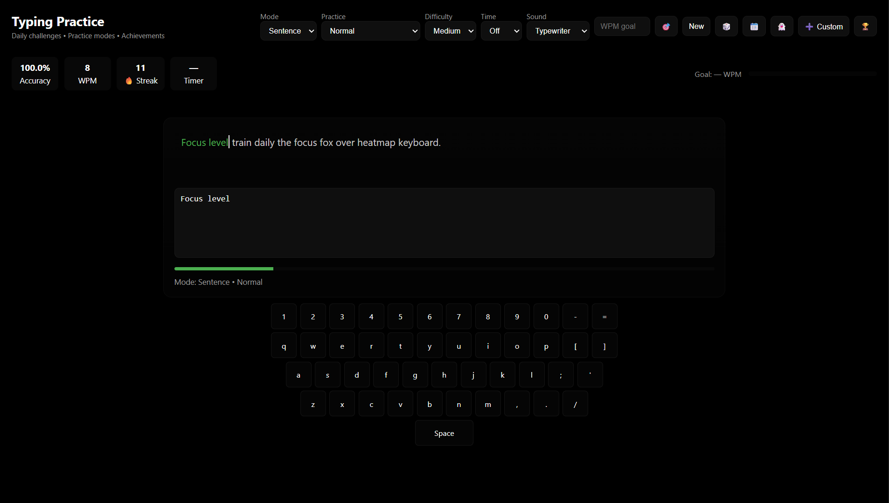
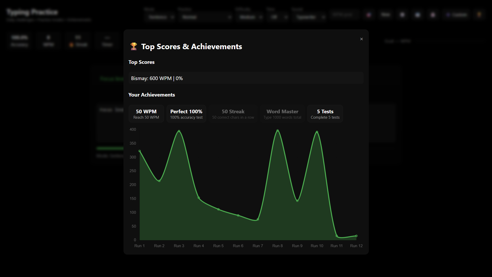

<!-- Banner -->


<p align="center">
  
</p>

<p align="center">
  <a href="https://bismay-exe.github.io/Typing-Practice/">
    
  </a>
  
  
  
  
  
</p>

---

## 📸 Preview

<p align="center">
  <table>
    <tr>
      <td align="center">
        <br>
        <b>Main Typing Screen</b>
      </td>
      <td align="center">
        <br>
        <b>Leaderboard & Achievements</b>
      </td>
    </tr>
  </table>
</p>

A modern **typing trainer with glassy UI**.  
Supports **Sentence, Word, Code, and Quote modes** with **practice types, achievements, ghost replay, leaderboard, daily challenges, and more**.

---

## ✅ Features at a Glance

<div align="center">

### ✍️ Multiple Modes  
Sentence · Word · Code · Quote  

---

### 🎯 Practice Modes  
Normal · Zen · Speed (10s) · Accuracy (3 mistakes)  

---

### 📊 Stats & Leaderboard  
Accuracy, WPM, Streak tracking  
History chart + Ghost replay  
Achievements & Badges  

---

### 🕹️ Daily & Custom  
Daily challenge text  
Custom lesson input  

---

### 🔊 Sound Themes  
Typewriter · Mechanical · Silent  

---

### 🎉 Fun Extras  
Confetti animation 🎊  
Keyboard visualization ⌨️  
Progress tracking + Goals 🎯  

</div>

---

## ⚙️ About Typing Practice Pro

<p align="center">
  <a href="https://bismay-exe.github.io/Typing-Practice/">
    
  </a>
</p>

<p align="center">
  <b>Typing Practice</b><br>
  Daily challenges • Ghost replay • Achievements • Leaderboard • Glassy UI
</p>

---

## ⌨️ Keyboard Shortcuts

| Key | Action |
|-----|--------|
| 🆕 `New` | Load new text |
| 🎲 `Random` | Random challenge |
| 📆 `Daily` | Daily challenge |
| 👻 `Ghost` | Replay best run |
| 🎯 `Goal` | Save WPM goal |
| 🏆 `Leaderboard` | View scores |

---

## 💡 Tips & Tricks

- Switch between **Sentence, Word, Code, Quote** for variety.  
- Try **Zen mode** for relaxed typing.  
- Use **Ghost Replay** to race against your best run.  
- Achieve badges by hitting milestones like **50 WPM, 100% accuracy, or 1000 words**.  

---

## 🛠️ Tech Stack  

<p align="center">
  
</p>

---

## 📊 GitHub Stats (Project)

<p align="center">
  
</p>

---

## ASCII Banner

<!--ascii-start-->
Font: `block`
Message: `Typing Practice Pro`
```text
___________             .__                           
\__    ___/__.__.______ |__| ____    ____             
  |    | <   |  |\____ \|  |/    \  / ___\            
  |    |  \___  ||  |_> >  |   |  \/ /_/  >           
  |____|  / ____||   __/|__|___|  /\___  /            
          \/     |__|           \//_____/             
__________                       __  .__              
\______   \____________    _____/  |_|__| ____  ____  
 |     ___/\_  __ \__  \ _/ ___\   __\  |/ ___\/ __ \ 
 |    |     |  | \// __ \\  \___|  | |  \  \__\  ___/ 
 |____|     |__|  (____  /\___  >__| |__|\___  >___  >
                       \/     \/             \/    \/
```
<!--ascii-end-->

---

## 🌐 Connect with me

<p align="center">
  <a href="https://github.com/Bismay-exe" target="_blank">
    
  </a>

  <a href="https://instagram.com/bismay.exe" target="_blank">
    
  </a>

  <a href="https://t.me/bismay_exe" target="_blank">
    
  </a>

  <a href="https://discord.com" target="_blank">
    
  </a>
</p>

<p align="center">
  <a href="https://youtube.com" target="_blank">
    
  </a>

  <a href="https://linkedin.com" target="_blank">
    
  </a>

  <a href="https://threads.net/@bismay.exe" target="_blank">
    
  </a>

  <a href="https://t.me/BismaysInventory" target="_blank">
    
  </a>
</p>


---
